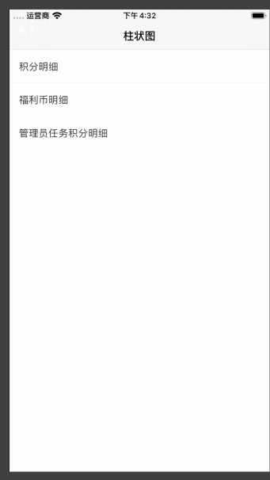
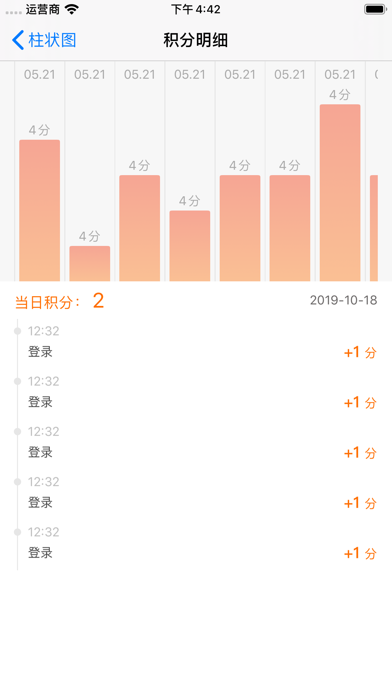
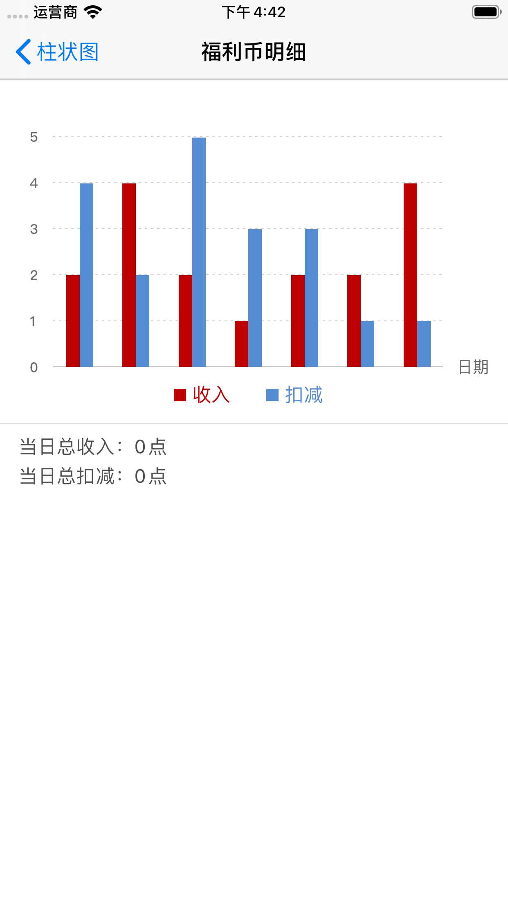
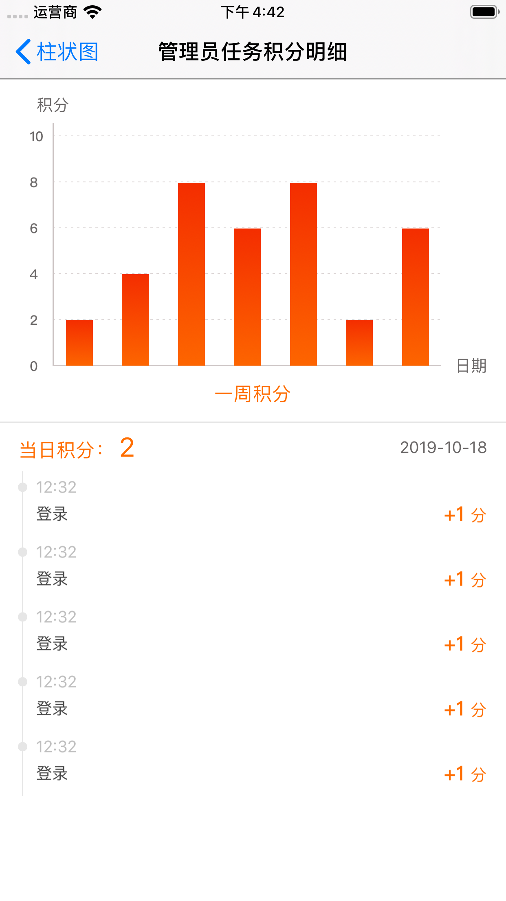

# JGHistogramView
自定义柱状图📊

### 自定义API

```
@interface ZYHistogramView : ZYBaseView
//纵轴数据
@property (nonatomic, strong) NSArray *YAxisArrM;
//颜色数组
@property (nonatomic, strong) NSArray *ColorsArrM;
//弹窗背景色
@property (nonatomic, strong) UIColor *ShowBgColor;
//横轴标题
@property (nonatomic, strong) NSArray *XTitlesArrM;
//柱状图是否需要渐变 默认:NO 不渐变
@property (nonatomic, assign) BOOL isGradient;
//分数 ---> 根据数据改成模型
@property (nonatomic, strong) NSArray *ScoreArrM;
//是否隐藏Y轴及单位 默认:NO 不隐藏
@property (nonatomic, assign) BOOL isHiddenYAxis;

@end
```


##效果图


   
 
